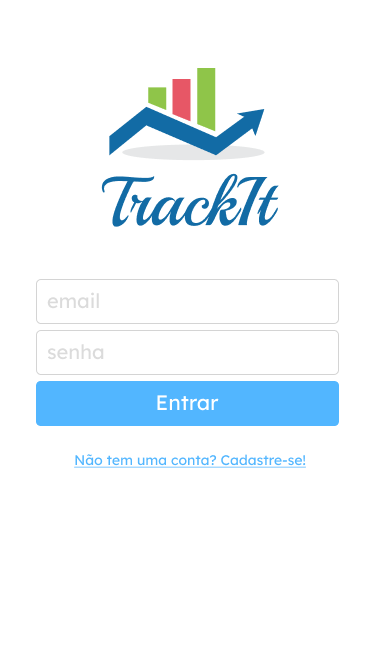
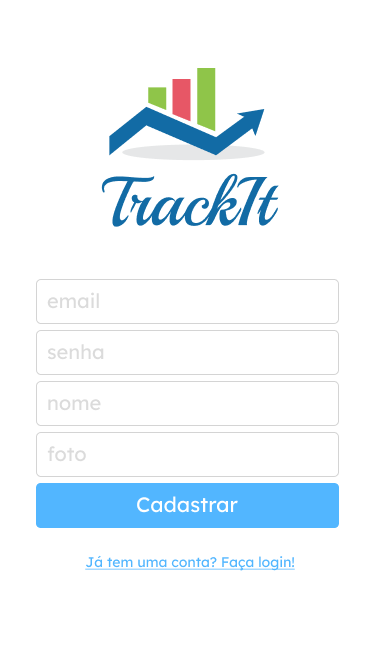
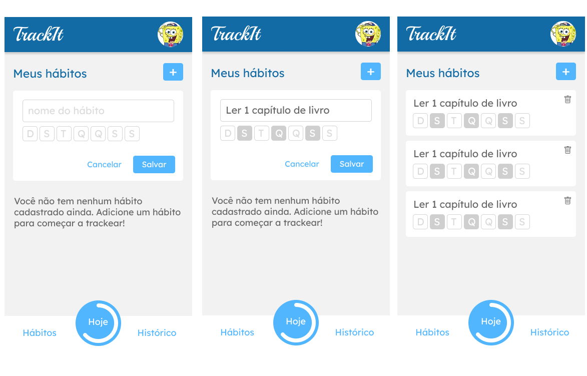
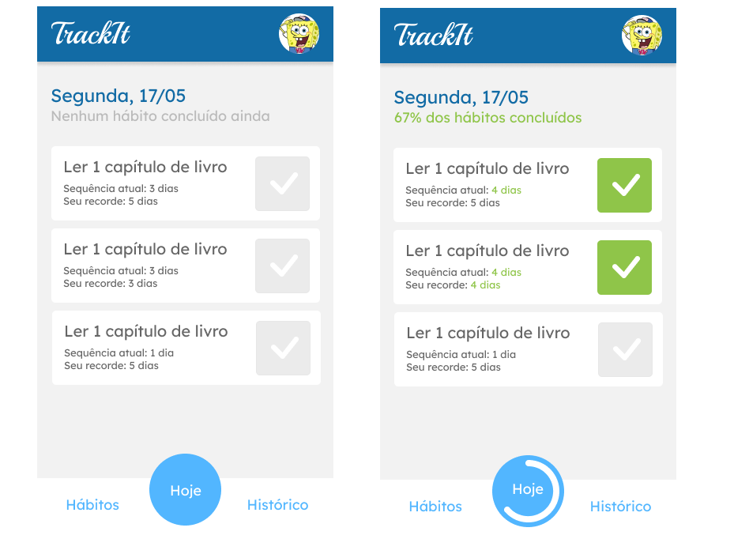
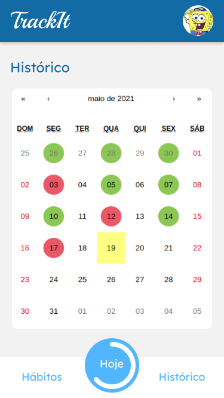

# <p align="center"> Projeto #10 - TrackIt </p>

<p align="center">
    
</p>

<p align="center">
   
   
</p>

## :clipboard: Descrição

O projeto TrackIt simula um aplicativo de hábitos onde o usuário poderá cadastrar tarefas diárias e acompanha-las determinando quais dias serão feitas e se elas foram completadas no dia atual ou em dias anteriores.

***

## :computer: Tecnologias

- JavaScript
- React, React Router Dom
- Context API

***

## :rocket: Rotas

### Rota `/`

- O usuário deve entrar com email e senha previamente cadastrados.
- Caso não possua cadastro é possível clicar no link abaixo do botão 'entrar' que irá redireciona-lo para a tela de cadastro.

<div align='center'>
       
</div>

### Rota `/cadastro`

- O usuário irá cadastrar no aplicativo o email, senha, seu nome e foto do perfil.
- Em caso de sucesso, será redirecionado para a tela de login (rota `/`).

<div align='center'>
       
</div>

### Rota `/habitos`

- Na tela de hábitos, o usuário poderá cadastrar, ver e deletar hábitos além de escolher os dias da semana em que deverá fazer.
- Caso o usuário não possua nenhum hábito, aparecerá uma mensagem na tela.
- É possível cadastrar um novo hábito ao apertar no botão (+).

<div align='center'>
       
</div>


### Rota `/hoje`

- Na tela 'Hoje' é possível ver apenas os hábitos do dia atual, sua sequência atual,  e o recorde de sequências.
- Ao clicar em um hábito ele é marcado como comcluído naquele dia e a barra de progresso em baixo é preenchida.

<div align='center'>
       
</div>

### Rota `/historico`

- No histórico é possível consultar os dias em que o usuário completou seus hábitos.
- Em verde são os dias que 100% dos hábitos foram completados, em vermelho, os dias que ficaram faltando algum hábito e em amarelo, o dia atual.

<div align='center'>
       
</div>

***

## 🏁 Rodando a aplicação

Este projeto foi inicializado com o [Create React App](https://github.com/facebook/create-react-app), então certifique-se que voce tem a ultima versão estável do [Node.js](https://nodejs.org/en/download/) e [npm](https://www.npmjs.com/) rodando localmente.

Primeiro, faça o clone desse repositório na sua maquina:

```
git clone https://github.com/luanalessa/projeto-backend.git
```

Depois, dentro da pasta, rode o seguinte comando para instalar as dependencias.

```
npm install
```

Finalizado o processo, é só inicializar o servidor
```
npm start
```